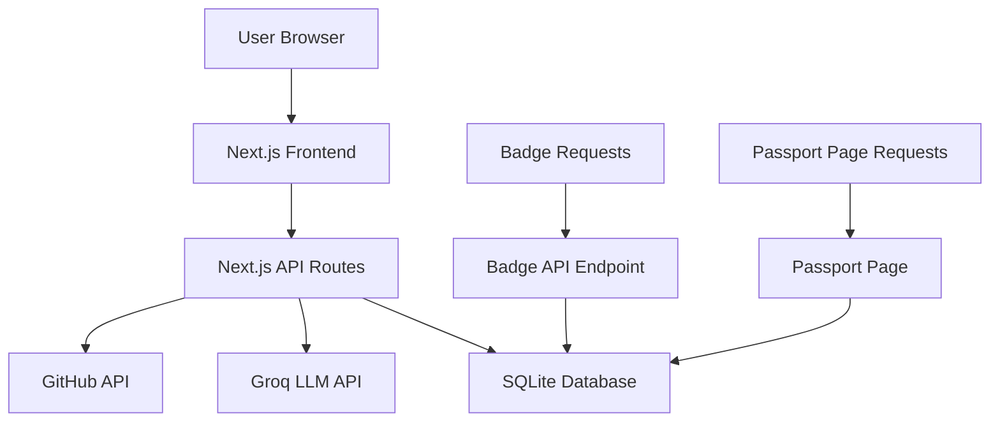

# Design Document

## Overview

The Humanity Passport application is built as a Next.js 14 application using the App Router architecture. The system follows a three-tier architecture with a React frontend, Next.js API routes for backend logic, and SQLite database for persistence. The application integrates with external services including GitHub API for repository metadata and Groq LLM for AI-powered analysis.

## Architecture

### High-Level Architecture



### Technology Stack

- **Frontend**: Next.js 14 with App Router, React 18, TailwindCSS, shadcn/ui components
- **Backend**: Next.js API routes, Groq SDK, Octokit (GitHub API client)
- **Database**: SQLite with Prisma ORM
- **External APIs**: GitHub REST API, Groq LLM API (gpt-oss-20b model)
- **Deployment**: Vercel-compatible hosting

## Components and Interfaces

### Frontend Components

#### HomePage Component
- **Purpose**: Main landing page with repository submission form
- **Props**: None
- **State**: 
  - `repoUrl: string` - User input for GitHub repository URL
  - `isSubmitting: boolean` - Loading state during submission
  - `error: string | null` - Error message display
- **Key Methods**:
  - `handleSubmit()` - Validates and submits repository URL
  - `validateGitHubUrl()` - Client-side URL validation

#### PassportPage Component
- **Purpose**: Displays detailed analysis for a specific repository
- **Props**: 
  - `owner: string` - Repository owner
  - `repo: string` - Repository name
- **State**:
  - `analysis: Analysis | null` - Analysis data from database
  - `isLoading: boolean` - Loading state
- **Key Methods**:
  - `copyBadgeMarkdown()` - Copies badge markdown to clipboard

#### Badge Component
- **Purpose**: Renders SVG badge based on analysis verdict
- **Props**:
  - `verdict: 'approved' | 'rejected' | 'pending'`
  - `owner: string`
  - `repo: string`
- **Returns**: SVG string with appropriate styling and link

### API Endpoints

#### POST /api/analyze
- **Input**: `{ repoUrl: string }`
- **Output**: `{ owner: string, repo: string, verdict: string, details: string }`
- **Process Flow**:
  1. Validate and parse GitHub URL
  2. Fetch repository metadata from GitHub API
  3. Send metadata to Groq LLM for analysis
  4. Parse LLM response for verdict and details
  5. Upsert analysis result in database
  6. Return analysis result

#### GET /api/badge/[owner]/[repo]
- **Input**: URL parameters (owner, repo)
- **Output**: SVG badge content with appropriate headers
- **Process Flow**:
  1. Query database for existing analysis
  2. Generate SVG based on verdict or pending state
  3. Return SVG with proper content-type headers

### External Service Interfaces

#### GitHub API Integration
```typescript
interface GitHubRepo {
  name: string;
  description: string;
  stargazers_count: number;
  topics: string[];
  default_branch: string;
}

interface GitHubReadme {
  content: string; // Base64 encoded
  encoding: string;
}
```

#### Groq LLM Integration
```typescript
interface GroqAnalysisRequest {
  model: 'gpt-oss-20b';
  messages: Array<{
    role: 'system' | 'user';
    content: string;
  }>;
}

interface GroqAnalysisResponse {
  choices: Array<{
    message: {
      content: string;
    };
  }>;
}
```

## Data Models

### Database Schema (Prisma)

```prisma
model Analysis {
  id        Int      @id @default(autoincrement())
  owner     String
  repo      String
  verdict   String   // 'approved' or 'rejected'
  details   String   // LLM analysis details
  createdAt DateTime @default(now())
  updatedAt DateTime @updatedAt

  @@unique([owner, repo])
  @@map("analyses")
}
```

### TypeScript Interfaces

```typescript
interface RepositoryMetadata {
  owner: string;
  repo: string;
  description: string;
  stars: number;
  topics: string[];
  readmeContent: string;
}

interface AnalysisResult {
  verdict: 'approved' | 'rejected';
  details: string;
  strengths: string[];
  concerns: string[];
}

interface BadgeConfig {
  approved: {
    color: '#22c55e';
    text: 'Humanity+ Passport';
  };
  rejected: {
    color: '#ef4444';
    text: 'Not Approved';
  };
  pending: {
    color: '#6b7280';
    text: 'Analysis Pending';
  };
}
```

## Error Handling

### Client-Side Error Handling
- **URL Validation**: Real-time validation of GitHub repository URLs
- **Network Errors**: Retry logic with exponential backoff for API calls
- **User Feedback**: Toast notifications for success/error states
- **Loading States**: Skeleton loaders and progress indicators

### Server-Side Error Handling
- **GitHub API Errors**: Handle rate limits, repository not found, private repositories
- **Groq API Errors**: Retry logic with circuit breaker pattern
- **Database Errors**: Connection pooling and graceful degradation
- **Input Validation**: Comprehensive validation using Zod schemas

### Error Response Format
```typescript
interface ErrorResponse {
  error: string;
  code: string;
  details?: string;
  retryable: boolean;
}
```

## Testing Strategy

### Unit Testing
- **Components**: React Testing Library for component behavior
- **API Routes**: Jest for endpoint logic and error handling
- **Utilities**: Pure function testing for validation and parsing
- **Database**: In-memory SQLite for isolated database tests

### Integration Testing
- **API Workflows**: End-to-end API testing with mock external services
- **Database Operations**: Test Prisma operations with test database
- **External Service Mocks**: Mock GitHub API and Groq API responses

### End-to-End Testing
- **User Flows**: Playwright tests for complete user journeys
- **Badge Generation**: Verify badge rendering and linking
- **Passport Pages**: Test public accessibility and content display

### Performance Testing
- **Load Testing**: Simulate concurrent repository submissions
- **Database Performance**: Query optimization and indexing validation
- **API Response Times**: Monitor external service integration performance

## Security Considerations

### Input Validation
- **URL Sanitization**: Strict GitHub URL pattern matching
- **Rate Limiting**: Per-IP submission limits using Redis or in-memory store
- **CORS Configuration**: Restrict API access to authorized domains

### Output Sanitization
- **LLM Content**: Sanitize AI-generated content to prevent XSS
- **SVG Generation**: Use safe SVG generation libraries
- **Database Queries**: Parameterized queries via Prisma ORM

### API Security
- **Environment Variables**: Secure storage of API keys
- **Request Validation**: Zod schemas for all API inputs
- **Error Information**: Avoid exposing sensitive system information

## Deployment Architecture

### Vercel Deployment
- **Static Generation**: Pre-render public pages where possible
- **API Routes**: Serverless functions for backend logic
- **Database**: SQLite file or upgrade to PostgreSQL for production
- **Environment Configuration**: Secure environment variable management

### Performance Optimizations
- **Caching Strategy**: Cache analysis results and badge SVGs
- **Image Optimization**: Next.js automatic image optimization
- **Bundle Optimization**: Tree shaking and code splitting
- **CDN Integration**: Static asset delivery via Vercel Edge Network